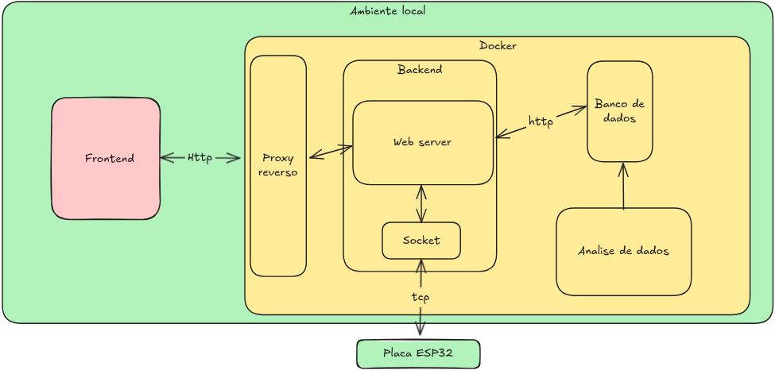

# Documento de arquitetura de softaware

## Ambiente Local

Todo o sistema é executado em um ambiente local, utilizando Docker para isolar e gerenciar os componentes do backend, banco de dados e serviços auxiliares.
Esse ambiente garante portabilidade, controle e fácil replicação do sistema em outros dispositivos.

## Frontend
O frontend é a interface com o usuário, responsável por enviar comandos e exibir os resultados de forma visual.
A comunicação entre o frontend e o backend é feita via HTTP, passando por um proxy reverso, que atua como intermediário, garantindo segurança e roteamento eficiente das requisições.

## Proxy Reverso

O proxy reverso tem a função de:

Direcionar requisições HTTP do frontend para o backend;

Prover isolamento e simplificar o acesso aos serviços internos via uma única rota local (ex: localhost:8080);

Facilitar futuras expansões da arquitetura, caso seja necessário escalar o backend ou adicionar autenticação.

## Backend

O backend é o núcleo da aplicação, executado dentro de um container Docker. Ele possui duas partes principais:

### Web Server (Flask)

* Responsável por expor endpoints HTTP para receber dados do frontend.

* Trata e valida as informações antes de armazená-las no banco de dados.

* Pode também fornecer dados processados para visualização.

### Socket Server (TCP)

* Mantém a comunicação direta com a placa ESP32, utilizando o protocolo TCP.

* Recebe dados do microcontrolador (ex: distância, ângulo, aceleração).

* Envia comandos ou confirmações de execução, garantindo comunicação bidirecional em tempo real.

## Banco de Dados

O banco de dados, também em container Docker, é acessado via HTTP pelo backend.
Ele é responsável por armazenar:

* Os dados recebidos da ESP32

* As informações tratadas e analisadas;

* O histórico de comandos enviados.

