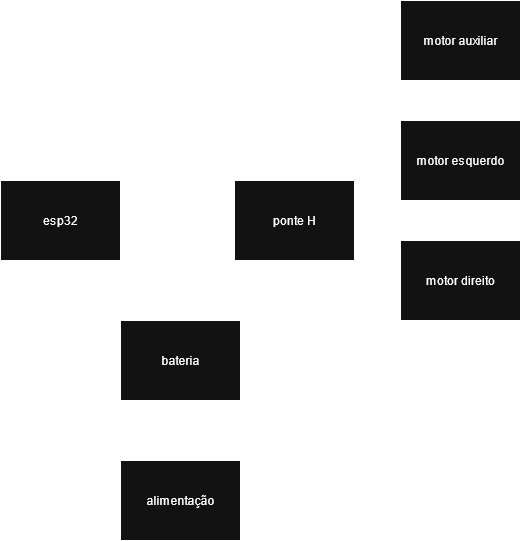

# Diagrama de Blocos do Hardware

O diagrama de blocos do Hardware, representado pela figura 1, provê uma visão de alto nível 
para os principais componentes de hardware do sistema. A esp32 controla a ponte H que deverá
prover energia para os motores principais. O motor auxiliar é diretamente alimentado pela esp32.
A esp e ponte H são alimentadas pela bateria, que deverá receber energia por meio de uma fonte de alimentação.

Obs: O diagrama será melhor apreciado no modo escuro de visualização.

## Figura 1 - Diagrama de Blocos do Hardware

**Fonte:** Equipe 2 