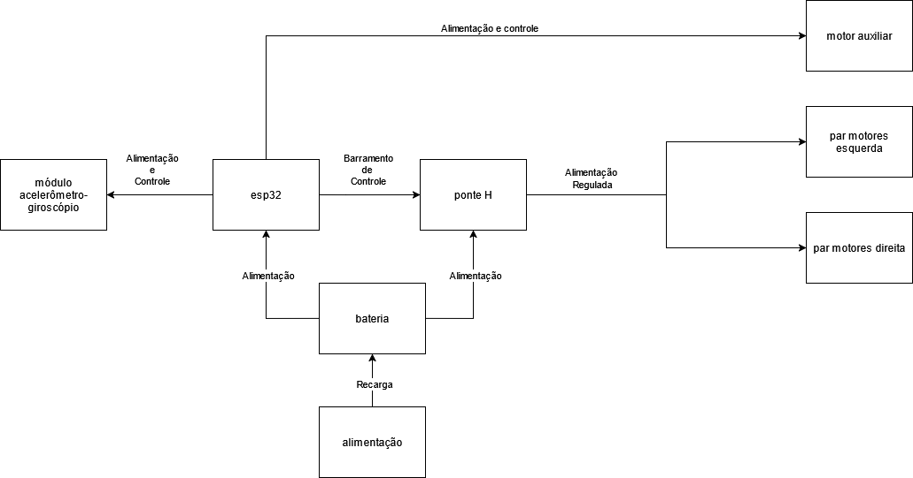

# Diagrama de Blocos do Hardware

O diagrama de blocos do Hardware, representado pela figura 1, provê uma visão de alto nível para os principais componentes de hardware do sistema. 

A esp32 controla a ponte H que deverá prover energia para os motores principais. São 2 pares, esquerdo e direito, totalizando 4 motores principais. O motor auxiliar é diretamente alimentado e controlado pela esp32.
A esp e ponte H são alimentadas pela bateria, que deverá receber energia por meio de uma fonte de alimentação.

## Figura 1 - Diagrama de Blocos do Hardware

**Fonte:** Equipe 2