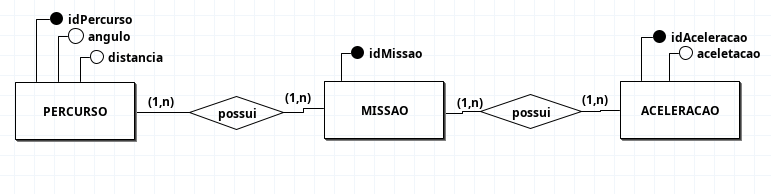

## Modelagem do banco

### Identificações das Entidades

* **ACELERACAO**
* **MISSAO**
* **PERCURSO**

### Descrições das Entidades (Atributos)

* **ACELERACAO** (<u>idAceleracao</u>, aceleracao)
* **MISSAO** (<u>IidMissao</u>)
* **PERCURSO** (<u>idPercurso</u>, angulo, distancia)

### Descrição dos Relacionamentos

* **MISSAO possui ACELERACAO**
    * **Regra de Negócio:** Uma `MISSAO` pode possuir **uma ou várias** `ACELERACOES`, e um mesmo registro de `ACELERACAO` pode estar associado a **uma ou várias** `MISSOES`.
    * **Cardinalidade:** (N:N)

* **MISSAO possui PERCURSO**
    * **Regra de Negócio:** Um `PERCURSO` pode estar associado a **uma ou várias** `MISSOES`, e uma `MISSAO` pode ocorrer em **um ou vários** `PERCURSOS`.
    * **Cardinalidade:** (N:N)

## Diagrama de Entidade-Relacionamento(DE-R)

## Análise de Dados do Sistema de Missões

Analisar os dados de cada missão é importante para entender pontos-chave, como o tempo total que ela leva para ser concluída. Ao observar os números de distância, ângulo e aceleração, conseguimos saber se o percurso foi feito de forma rápida, se o equipamento está funcionando corretamente.

Para garantir a qualidade e a validade dos dados, as seguintes regras de negócio são aplicadas durante a coleta e o processamento:

* **Integridade do Ângulo:** O valor do `angulo` deve ser sempre entre 0 e 360 graus.
* **Validade da Aceleração:** O valor de `aceleracao` não pode ser muito pequena (e.g. 0.00001).
* **Validade do Percurso:** A `distancia` de um percurso não pode ser negativa.

### Tabela de Análise de Dados Fictícios

A tabela abaixo apresenta um resumo estatístico de dados coletados.

| Métrica | Mínimo | Média | Máximo |
| :--- | :---: | :---: | :---: |
| **Distância do Percurso (metros)** | 50.5 cm | 33.15 cm | 15.8 cm |
| **Ângulo de Manobra (graus)** | 0.0° | 95.3° | 359.9° |
| **Aceleração Aplicada (m/s²)** | 1.0 cm/s² | 4.35 cm/s² | 7.7 cm/s² |
